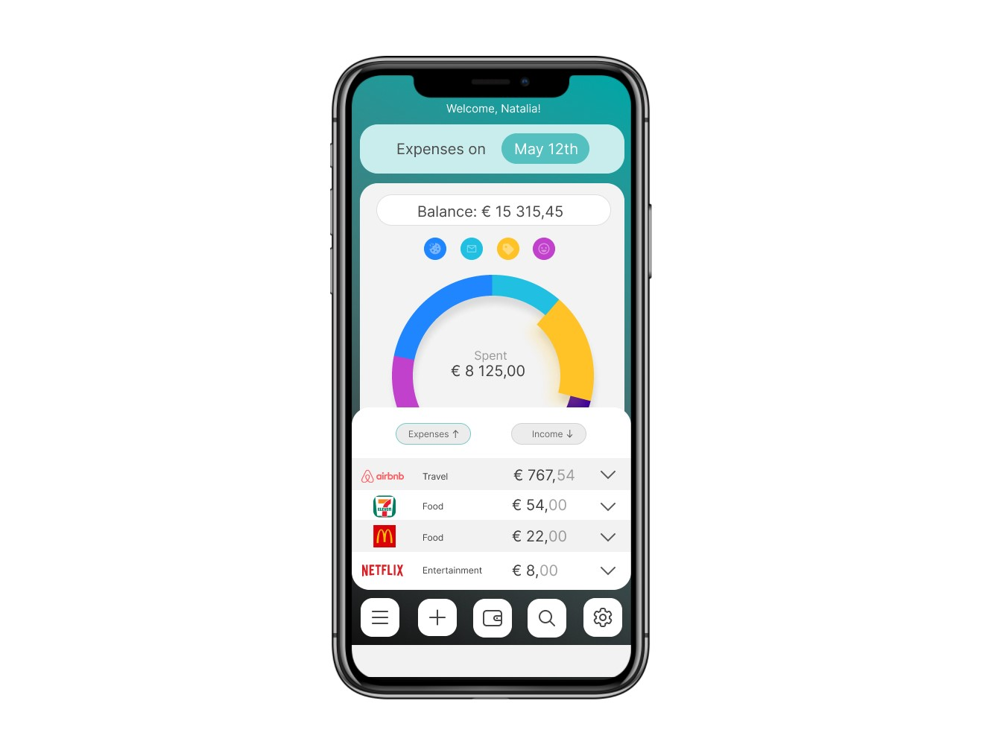
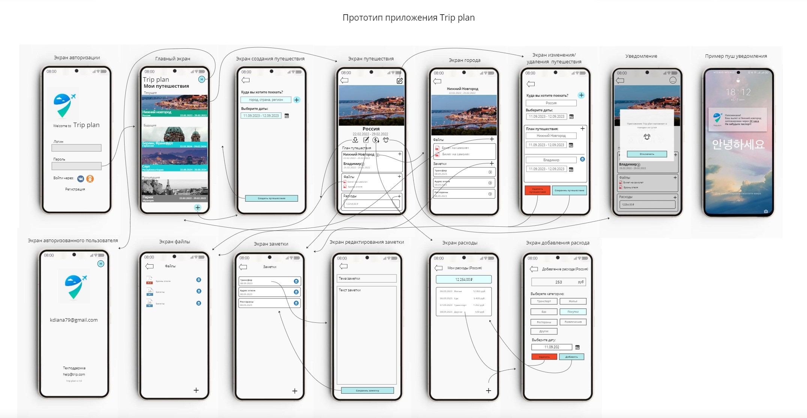

<h1>Natalia's portfolio</h1>

Welcome to my portfolio!
## 📚 Table of Contents
- [How to Create Your Profile?](#how-to-create-your-profile)
- [Prototypes](##Prototypes)
- [SQL](##SQL)
- [Travel plan app (diploma)](##Travel plan app (diploma))

___

## Prototypes
1. link to figma <a href="https://www.figma.com/proto/fKyYFi0qrNkGeUYZLYyP6y/%D0%9F%D1%80%D0%BE%D1%82%D0%BE%D1%82%D0%B8%D0%BF?node-id=2-3&scaling=scale-down&page-id=1%3A2&starting-point-node-id=2%3A3&mode=design&t=d8PeZjRUUQvIGgCz-1" target="_blank">prototype</a> (working buttons: income, expences and calendar)

2. prototype made in Miro and Photoshop

___

##SQL

___
##Travel plan app (diploma)
