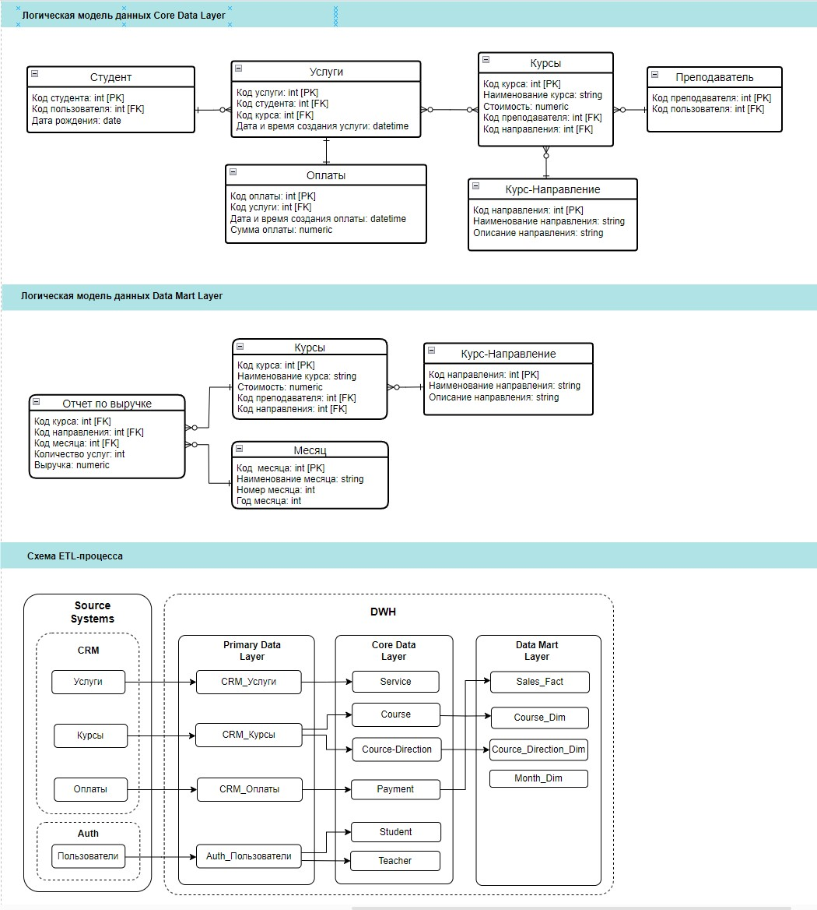

<h1>Natalia's portfolio</h1>

Welcome to my portfolio!
## 📚 Table of Contents

- [Prototypes](#Prototypes)
- [SQL](#SQL)
- [BI](#BI)
- [Travel plan app (diploma)](#Travel-plan-app-diploma)
- [Data Warehouse](#DWH)

___

## Prototypes
1. link to figma <a href="https://www.figma.com/proto/fKyYFi0qrNkGeUYZLYyP6y/%D0%9F%D1%80%D0%BE%D1%82%D0%BE%D1%82%D0%B8%D0%BF?node-id=2-3&scaling=scale-down&page-id=1%3A2&starting-point-node-id=2%3A3&mode=design&t=d8PeZjRUUQvIGgCz-1" target="_blank">prototype</a> (working buttons: income, expences and calendar)

2. prototype made in Miro and Photoshop

___

## SQL

___

## BI

___

## Travel-plan-app-diploma
В процессе разработки дипломного проекта - мобильно приложения для планирования путешествий...

Link to a [pdf](https://github.com/nataliashved/portfolio/blob/7d7978b8157ae4e6478324dbeb71b38c5bbcc0b4/%D0%9F%D1%80%D0%B5%D0%B7%D0%B5%D0%BD%D1%82%D0%B0%D1%86%D0%B8%D1%8F%20%D0%94%D0%B8%D0%BF%D0%BB%D0%BE%D0%BC.pptx.pdf) diploma on a 14 pages

## DWH
Online univercity

Core Data Layer, Data Mart Layer, ETL

Technical specifications and Data Quality <a href="https://docs.google.com/spreadsheets/d/17Da7IS6fAjHAVv1_yUw3HUlk2hFT_h_5kpTfDOwxJ-s/edit?usp=sharing">here</a>
